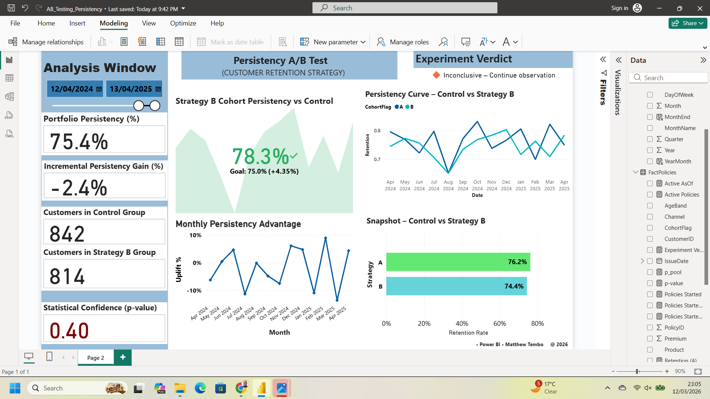

# AB Testing Persistency Dashboard in Power BI

## Overview
This project is a Power BI dashboard focused on **A/B testing and customer persistency analysis**. It was built to evaluate how two different strategic approaches or treatment groups perform over time, with particular attention to customer retention, persistency trends, and experiment outcomes.

The goal of the dashboard is not only to compare results between test groups, but also to support better business decisions by translating experiment metrics into a clear performance story.

## Project Objective
The objective of this project was to build an interactive dashboard that helps answer questions such as:

- Which test group is performing better?
- Are customers being retained more effectively in one group than the other?
- Is the observed difference meaningful enough to influence strategy?
- How should persistency performance be interpreted over time?
- At what point should a business continue, modify, or abandon a new strategy?

## Tool Used
- Power BI

## Key Focus Areas
This dashboard is centered around:

- **A/B testing analysis**
- **Persistency / retention tracking**
- **Performance comparison between treatment groups**
- **Strategic interpretation of experiment results**
- **Decision-support analytics**

## Dashboard Features
The report includes interactive views for:

- comparison of **Group A vs Group B**
- persistency / retention trends over time
- experiment performance indicators
- summary visuals for business interpretation
- KPI-based monitoring of strategy performance

## Business Relevance
A/B testing is often presented as a statistical exercise, but in practice it is a **business decision tool**. This project was designed with that perspective in mind.

The dashboard helps connect experiment results to strategic questions such as:

- Is the new strategy creating better customer outcomes?
- Are observed improvements large enough to matter operationally?
- Should the organization continue observing, scale the strategy, or reconsider it?

## Key Insight
One of the most important lessons from this project is that **a better-looking result is not always enough on its own**. In strategy and analytics, what matters is whether the observed difference is consistent, decision-relevant, and supported strongly enough to guide action.

This is where dashboards become more valuable — not just in showing what happened, but in helping decision-makers think clearly about what should happen next.

## Screenshot
ab-testing-persistency-dashboard

## Notes
This project was developed as part of my analytics portfolio to demonstrate skills in:

- Power BI dashboard development
- experiment analysis
- customer persistency / retention interpretation
- KPI design
- analytical storytelling
- business-focused data communication

## Portfolio Value
This project is relevant for roles in:

- Business Intelligence
- Data Analytics
- Strategy and Performance
- Customer Analytics
- Commercial Analytics
- Experimentation / Testing Analytics

## Author
Matthew Tembo

*Demo data for illustration.*
